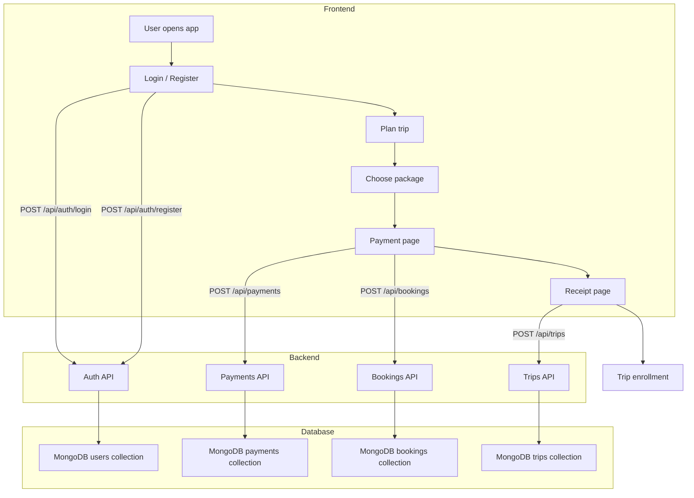
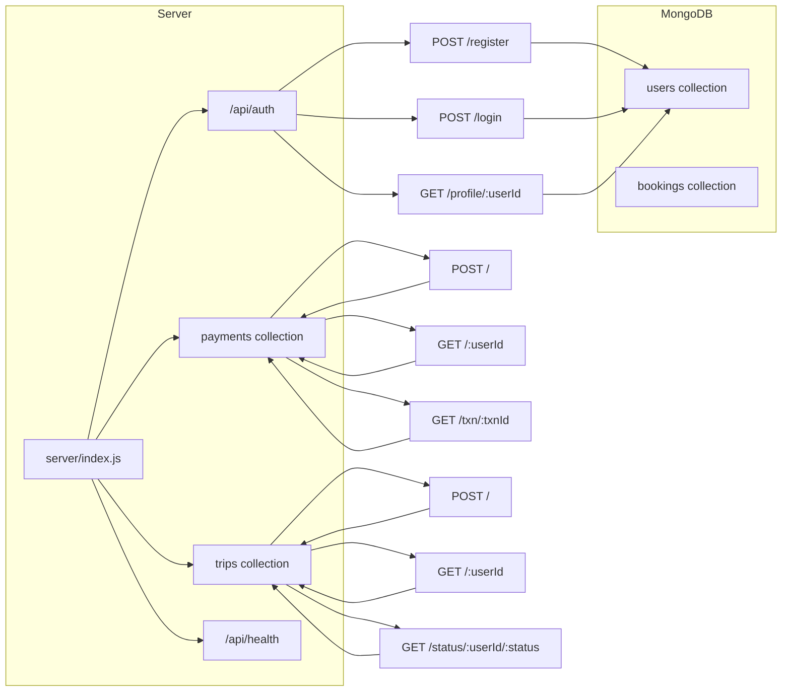

# Smart Tour Planner Architecture

## Overview

This document summarizes the project architecture for `indiatour-planner-go-main`, including the frontend flow, backend API layers, and database model relationships.

## Frontend Architecture

- **Framework**: React + Vite
- **Routing**: React Router
- **State**: `sessionStorage` for temporary session data
- **API client**: `src/lib/api.ts`

### Main pages

- `/` → `src/pages/Login.tsx`
- `/plan` → `src/pages/Plan.tsx`
- `/packages` → `src/pages/Packages.tsx`
- `/payment` → `src/pages/Payment.tsx`
- `/receipt` → `src/pages/Receipt.tsx`
- `/trip-map` → `src/pages/TripMap.tsx`

### Browser session storage keys

- `stp_user`
- `stp_userId`
- `stp_userInfo`
- `stp_plan`
- `stp_booking`
- `stp_receipt`

## Backend Architecture

- **Server**: Express
- **ORM**: Mongoose
- **Database**: MongoDB Atlas
- **Server entry**: `server/index.js`

### Mounted API routes

- `/api/auth` → `server/routes/auth.js`
- `/api/payments` → `server/routes/payments.js`
- `/api/trips` → `server/routes/trips.js`
- `/api/health` → health check endpoint

> Note: `server/routes/bookings.js` and `server/models/Booking.js` exist in the codebase, but `server/index.js` does not mount the `/api/bookings` route.

## Database models

- `User` (`server/models/User.js`)
- `Payment` (`server/models/Payment.js`)
- `Trip` (`server/models/Trip.js`)
- `Booking` (`server/models/Booking.js`)

## Mermaid diagrams

### User journey flowchart

### Backend route architecture

## Notes

- The app uses `sessionStorage` to coordinate user context and booking state across pages.
- The backend includes a database guard middleware (`requireDB`) that delays API route access until MongoDB is reachable.
- The `Receipt` page triggers a trip enrollment call after payment data is available.
- Because `/api/bookings` is not mounted in `server/index.js`, some frontend booking persistence may not reach the backend unless that route is added.
